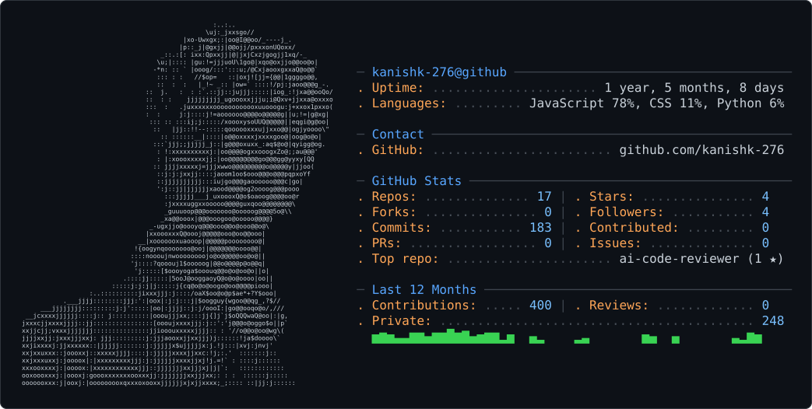

<picture>
  <source media="(prefers-color-scheme: dark)" srcset="dark_mode.svg" />
  <source media="(prefers-color-scheme: light)" srcset="light_mode.svg" />
  
</picture>
---

### 🚀 About Me

I am a Full-Stack Developer deeply invested in the **MERN ecosystem**. I enjoy bridging the gap between robust backend architecture and intuitive user interfaces.

- 🛠️ **Current Focus:** Building high-impact **Full Stack Projects** and mastering cross-platform mobile development.
- 🤖 **AI & ML:** Enthusiastic about **Artificial Intelligence and Machine Learning**, exploring how to integrate intelligent models into web and mobile applications.
- 📧 **Reach out:** [contact.kanishkgupta@gmail.com](mailto:contact.kanishkgupta@gmail.com)

---

### 💻 Tech Stack

- Frontend

  

- Database

  

- Tools

  

---
